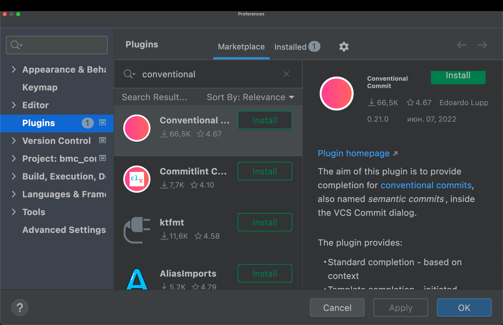
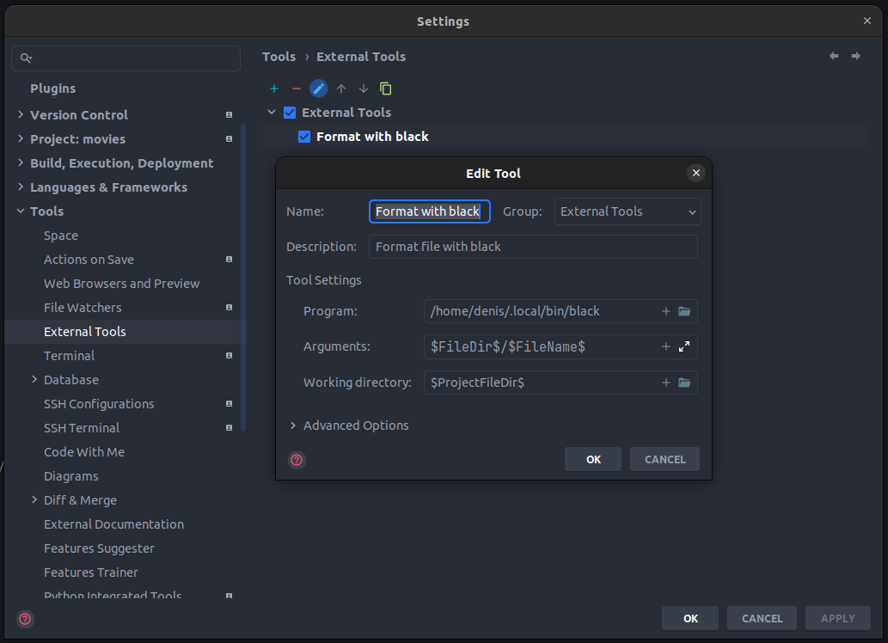
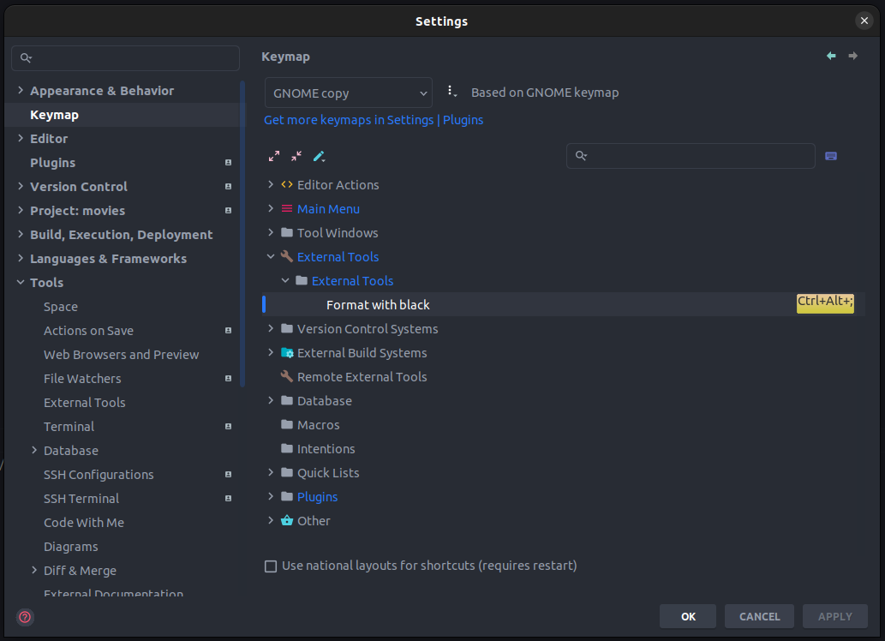

# О проекте


Телеграм-бот "Ты в порядке" для записи людей на консультации с психологом

Задачи бота:
* записывать людей на индивидуальные консультации;
* прохождение тестов;
* обратная связь для людей, получивших консультацию.


# Requirements


* Python 3.10
* Docker 20.10+ [(инструкция по установке)](https://docs.docker.com/get-docker/).


# Запуск проекта


Все команды, приведенные в данном руководстве, выполняются из корневой директории проекта, если
иное не указано в описании.

## Проверка docker
По умолчанию проект запускается в докере. Перед запуском проекта нужно убедиться, что докер
установлен. Открой любой терминал и выполни следующую команду:
```
docker --version
```
Должна быть выведена версия докера, это выглядит примерно так:
```
Docker version 20.10.21, build baeda1f
```
Если докер не установлен, то установи его, следуя [инструкции](https://docs.docker.com/get-docker/).

## Настройка переменных окружения
Переменные окружения проекта хранятся в файле `.env`, для которого есть шаблон `.env.template`.
Создай в корне проекта файл `.env` простым копированием файла `.env.template`.

## Запуск сервисов
Для запуска проекта выполни следующую команду:
```
docker-compose up -d --build
```
Убедимся, что все контейнеры запущены:
```
docker-compose ps
```
Результат должен быть примерно такой (список сервисов может отличаться, но статус всех сервисов
должен быть `running`):
```
NAME                           COMMAND                  SERVICE             STATUS              PORTS
bmc_companion_bot-bot-1        "/scripts/entrypoint…"   bot                 running
bmc_companion_bot-nginx-1      "/docker-entrypoint.…"   nginx               running             0.0.0.0:80->80/tcp
bmc_companion_bot-postgres-1   "docker-entrypoint.s…"   postgres            running             0.0.0.0:5435->5432/tcp
bmc_companion_bot-redis-1      "docker-entrypoint.s…"   redis               running             0.0.0.0:6379->6379/tcp
bmc_companion_bot-webapi-1     "/scripts/entrypoint…"   webapi              running
```
Перейди по адресу [http://127.0.0.1/api/v1/healthcheck/ping/](http://127.0.0.1/api/v1/healthcheck/ping/).
Если все ок, то должно быть сообщение `pong`.

Чтобы заработал бот, нужно задать действующий токен бота для переменной `BOT_TOKEN` в файле `.env`,
а затем снова запустить все сервисы через `docker-compose`.

Остановить и удалить запущенные контейнеры:
```
docker-compose down
```


# Создание среды разработки


## Установка Poetry
Poetry - это пакетный менеджер для python, аналог `pip`. Подробнее про установку Poetry [здесь](https://python-poetry.org/docs/#installation).

Команды для установки Poetry:

**Linux, macOS, Windows (WSL)**
```
curl -sSL https://install.python-poetry.org | python3 -
```
**Windows (Powershell)**
```
(Invoke-WebRequest -Uri https://install.python-poetry.org -UseBasicParsing).Content | py -
```
**Важно:** после установки нужно вручную добавить путь к Poetry в переменную среды PATH.

Например, на Mac это можно сделать, добавив в файл `.zprofile` (/Users/your-user-name/.zprofile) следующие строки:
```
PATH="$HOME/.local/bin:$HOME/bin:$PATH"
export PATH
```
Подробнее [здесь](https://github.com/python-poetry/poetry/issues/507) и раздел [Add Poetry to your PATH](https://python-poetry.org/docs/#installation)
в документации.

**Важно:** после установки Poetry, нужно перезапустить терминал.

Теперь проверим, что Poetry установлен корректно:
```
poetry --version
```
Результат выполнения команды должен быть такой (версия должна быть не ниже):
```
Poetry (version 1.3.1)
```

## Установка зависимостей
Сначала нужно активировать виртуальную среду:
```
poetry shell
```
Теперь можно установить все зависимости:
```
poetry install
```

## Установка pre-commit хуков
Пакет [pre-commit](https://pre-commit.com/) включен в список зависимостей и устанавливается
командой `poetry install`. Для проверки корректности установки `pre-commit`
нужно выполнить команду:
```
pre-commit --version
```
В ответ должна быть выведена версия pre-commit - это значит, что все установлено корректно:
```
pre-commit 2.20.0
```

Установи pre-commit хуки:
```
pre-commit install
pre-commit install --hook-type commit-msg
```
Если установка прошла успешно, то ты увидишь следующее сообщение:
```
pre-commit installed at .git/hooks/pre-commit
```
Теперь все готово к разработке.


# Режим разработки


## Запуск и отладка сервиса webapi
Для запуска и отладки сервиса webapi нужно, чтобы была запущена база данных и redis.

Сначала остановим все запущенные контейнеры:
```
docker-compose down
```
Запустим базу данных и redis:
```
docker-compose up -d --build postgres redis
```
Теперь можно запустить сам сервис:
```
python webapi/src/manage.py
```
Перейди по адресу [http://127.0.0.1:5000/api/v1/healthcheck/ping/](http://127.0.0.1:5000/api/v1/healthcheck/ping/).
Если выдается `pong`, значит все ок.

Ты можешь настраивать хост и порт с помощью переменных окружения `APP_HOST` и `APP_PORT`.

Отлаживать сервис можно с помощью стандартного дебаггера в PyCharm. Для этого запусти debug файла
`webapi/src/manage.py`.

## Запуск и отладка сервиса bot
Для того чтобы бот заработал, нужно установить валидный токен бота для переменной окружения
`BOT_TOKEN`.

Процесс запуска и отладки сервиса bot ничем не отличается от процесса запуска и отладки сервиса
webapi, только используется другой файл.

Запустить сервис bot:
```
python bot/src/run.py
```

## Управление миграциями базы данных
Базой данных управляет сервис webapi.

После изменения моделей в файле `models.py` нужно сформировать миграции. Перед этим убедись,
что у тебя запущена база данных.

**Важно:** для выполнения миграций необходимо находиться в папке `webapi/src`.

Перейди в папку `webapi/src`:
```
cd webapi/src
```

Сформировать файлы миграции:
```
python -m flask db migrate -m "Your comment"
```
Применить миграции:
```
python -m flask db upgrade
```


# Особенности разработки


При разработке необходимо придерживаться установленных правил оформления кода.
В этом разделе ты найдешь описание настроек редактора кода, линтеры и форматеры,
используемые в проекте, а также другие особенности, которые необходимо учитывать при разработке.

## Управление зависимостями
В качестве пакетного менеджера используется [Poetry](https://python-poetry.org/). Для управления зависимостями используются группы (см. файл `pyproject.toml`).

Все основные зависимости располагаются в группе `tool.poetry.dependencies`:
```
[tool.poetry.dependencies]
python = "^3.10"
Django = "^4.1"
```
Добавление основной зависимости:
```bash
poetry add pendulum
```
Остальные зависимости делятся на группы. Например, группа `lint` - зависимостей для линтинга:
```
[tool.poetry.group.lint.dependencies]
flake8 = "^5.0.4"
flake8-broken-line = "^0.5.0"
flake8-quotes = "^3.3.1"
pep8-naming = "^0.13.2"
```
Добавление зависимости в конкретную группу (используй флаг `--group` и название группы):
```bash
poetry add pytest --group test
```

## Руководства по стилю
### Импорты
Выполняй импорты из каталогов, вложенных в `src`. Следи, чтобы твои импорты не начинались
с папки `src`.

Рассмотрим пример следующей структуры каталогов:
```
\
├── project_name
│   ├── src
│   │   ├── app
│   │   │   ├── auth
│   │   │   │   └── routes.py
│   │   │   └── models.py
│   │   └── manage.py
└── └── docker
```
Необходимо выполнить импорт моделей из файла `models.py` в файл `routes.py`.

Неправильно:
```python
from src.app.models import User
```
Правильно:
```python
from app.models import User
```
Если ты используешь PyCharm, то можешь пометить каталог `src` как `Source Root`
(правой кнопкой -> Mark Directory as -> Mark as Source Root), тогда PyCharm будет корректно
добавлять импорты.

Такое использование импортов необходимо для корректной контейнеризации приложения в докере.
Внутри докер-контейнера папка приложения может называться по-другому, например, мы захотим
назвать её `app`. В Dockerfile это будет выглядеть так:
```dockerfile
ARG HOME_DIR=/app
WORKDIR $HOME_DIR

COPY ./src .
```
На хосте каталог называется `src`, а в контейнере `app`. Импорт из `src` приведет к ошибке:
```
ModuleNotFoundError: No module named 'src'
```

## Conventional Commits
Твои комментарии к коммитам должны соответствовать [Conventional Commits](https://www.conventionalcommits.org/en/v1.0.0/).
Pre-commit хук `conventional-pre-commit` выполнит проверку комментария перед коммитом.

Если твой комментарий не соответствует конвенции, то в терминале ты увидишь подобное сообщение:
```bash
commitizen check.........................................................Failed
- hook id: conventional-pre-commit
- exit code: 1
```
Для более удобного написания комментариев к коммитам, ты можешь воспользоваться плагином
Conventional Commit для PyCharm:


## Настройки IDE
Проект содержит файл `.editorconfig` - ознакомься с ним, чтобы узнать какие настройки
должны быть в твоем редакторе.

## Форматер и линтер
В качестве форматера мы используем [black](https://github.com/psf/black).
Конфиг black см. в файле `pyproject.toml` в секции `[tool.black]`.

Линтер - flake8, конфиг находится в файле `setup.cfg`.

Если ты используешь PyCharm, то можешь настроить форматирование файла с помощью black
через External Tools:


Также можно назначить hot key для этого действия:



# Работа с GIT


## Основное
Все коммиты должны быть на русском языке.

*Важно!!! Для быстрого прохождения код-ревью, для снижения merge conflict придерживайся
следующих правил:*

1. Один PR может содержать несколько коммитов.
2. В коммит добавляй только измененные файлы, в которых решается только твоя задача.
3. Не добавляй папки полностью, добавляй файлы по отдельности.
4. Не изменяй форматирование других файлов и не добавляй их в коммит.

## Правила работы с репозиторием
### Правила именования веток
Название ветки должно быть сформировано по правилу `{type}/{name}`, где:
* `type`: тип (feat, fix и т.п.) согласно [conventional-commits](https://www.conventionalcommits.org/en/v1.0.0/);
* `name`: внятное короткое название на английском (слова разделены дефисом).

### Правила написания коммитов
Согласно [conventional-commits](https://www.conventionalcommits.org/en/v1.0.0/) комментарий к коммиту
должен начинаться с типа (feat, fix и т.п.).

Придерживайся простых формулировок. Используй слова "добавлен", "исправлен" вместо
"добавил(а)", "исправил(а)", "пофиксил(а)",

### Решение ошибок при коммитах
Для того чтобы не было ошибок при выполнении коммитов, перед добавлением файлов в индекс,
выполни форматирование (находясь в корне проекта):
```
isort .
black .
```
После этого можешь смело выполнять git add и git commit.

При выполнении команды `git commit` могут возникать непонятные на первый взгляд ошибки. Например,
такие:
```
isort.............................Failed
- hook id: isort
- files were modified by this hook

Skipped 2 files
.../site-packages/isort/main.py:104: UserWarning: Unable to parse file ./bot/src/run.py due to [Errno 2] No such file or directory: '/Users/denis/Documents/projects/bmc/bmc_companion_bot/bot/src/run.py.isorted' -> '/Users/denis/Documents/projects/bmc/bmc_companion_bot/bot/src/run.py'
  warn(f"Unable to parse file {file_name} due to {error}")
/Users/denis/Library/Caches/pypoetry/virtualenvs/bmc-TOtCo-TH-py3.10/lib/python3.10/site-packages/isort/main.py:104: UserWarning: Unable to parse file ./webapi/src/app/__init__.py due to [
```
В этом нет ничего страшного, просто выполни еще раз команду добавления в индекс:
```
git add .
```
Затем снова повтори коммит.

### Flow работы с репозиторием
1. Клонируй репозиторий:
```
git clone git@github.com:Studio-Yandex-Practicum/bmc_companion_bot.git
```

Если нужно получить все изменения из главной ветки:
```
git pull origin develop
```

2. Создай ветку для своей задачи, следуя правилам;

3. Переключись на созданную ветку:
```
git checkout feat/model_user
```

4. Внеси изменения в код;

5. Выполни форматирование (находясь в корне проекта):
```
isort .
black .
```

6. Посмотри какие файлы были изменены:
```
git status
```

Добавь измененные файлы в индекс:
```
git add model.py service.py
```

Создай новый коммит и запуш его:
```
git commit -m 'feat: commit description'
git push origin feat/model_user
```

6. Создай pull request из своей ветки в ветку `develop`
